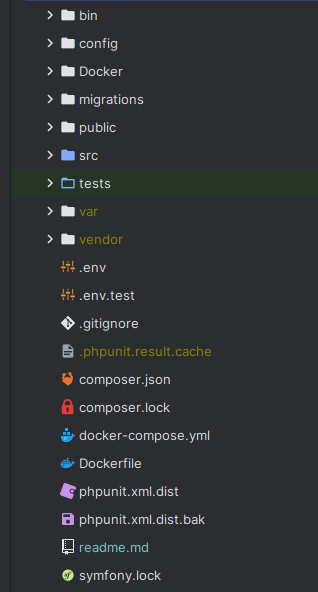
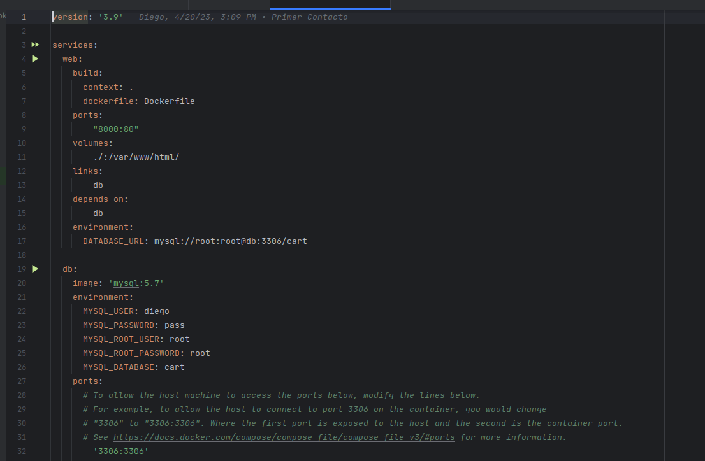
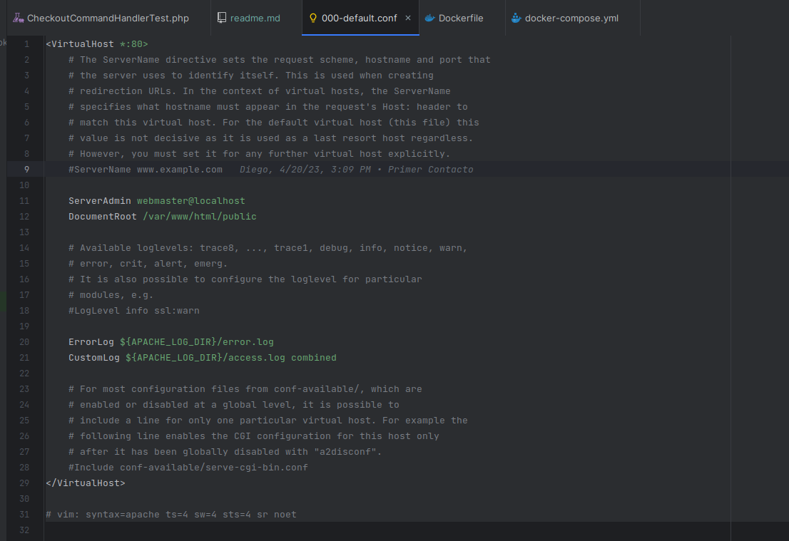
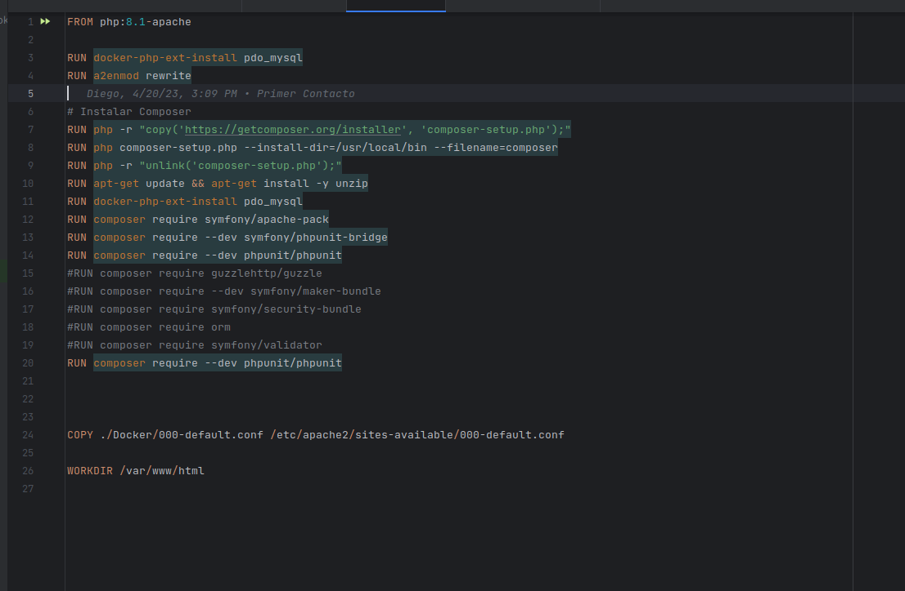
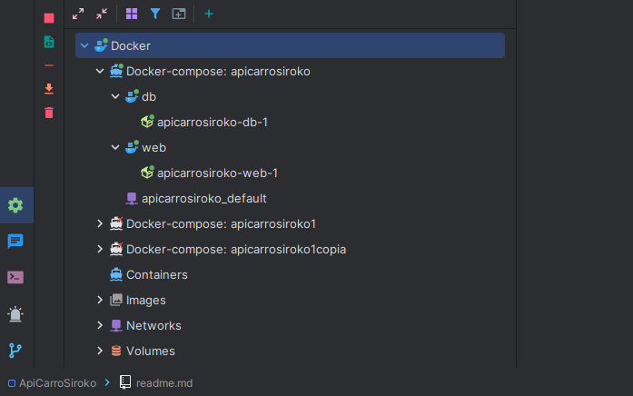
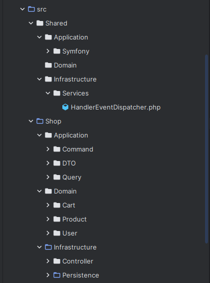
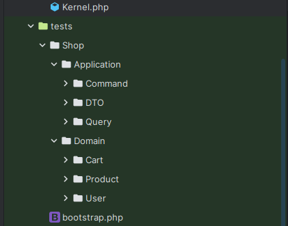
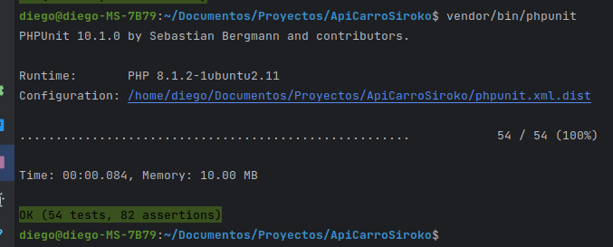

# Siroko API Carrito


* [Siroko API Carrito](#siroko-api-carrito)
    * [1. Instalación de Symfony](#1-instalación-de-symfony)
    * [2. Configuración del framework para trabajar con docker](#2-configuración-del-framework-para-trabajar-con-docker)
        * [Por que docker?](#por-que-docker)
        * [Generamos archivo docker compose y dockerfile](#generamos-archivo-docker-compose-y-dockerfile)
    * [3. Dependencias necesarias](#3-dependencias-necesarias)
    * [4. Configuración de nuestras entidades y mapeos con Doctrine](#4-configuración-de-nuestras-entidades-y-mapeos-con-doctrine)
    * [5. Modelado de la aplicación](#5-modelado-de-la-aplicación)
        * [Arquitectura hexagonal](#arquitectura-hexagonal)
        * [DDD (Domain Driven Design)](#ddd-domain-driven-design)
    * [6. Funcionamiento de la API](#6-funcionamiento-de-la-api)
    * [6. Pruebas Unitarias](#6-pruebas-unitarias)
    * [7. Webgrafía y referencias.](#7-webgrafía-y-referencias)

<!-- TOC -->

## 1. Instalación de Symfony

Para comenzar el proyecto, lo primero que hicimos fue instalar Composer en nuestro sistema.

Composer es una herramienta de administración de paquetes de PHP que nos permitirá instalar y administrar las
dependencias de nuestro
proyecto de forma sencilla.

Lo instalamos con el siguiente comando:

```
sudo apt-get update
sudo apt-get install composer
```

Una vez instalado ejecutamos el siguiente comando para crear un nuevo proyecto Symfony:

```
composer create-project symfony/skeleton .
```

Esto ya nos genera la estructura de carpetas de un proyecto symfony.

<p align="center">

</p>

## 2. Configuración del framework para trabajar con docker

### Por que docker?

Utilizamos para este proyecto para que nos permita utilizar el proyecto en cualquier equipo con docker
sin necesidad de más configuraciones que tener instalado docker.

### Generamos archivo docker compose y dockerfile

Generamos las configuraciones necesarias en el archivo **docker-compose** para crear el contenedor:

* Necesitaremos una imagen con apache para desplegar la app
* Una imagen con php
* Una imagen con base de datos para almacenar nuestra información.

<p align="center">

</p>

Generamos las configuraciones necesarias en el archivo **Dockerfile** para las configuraciones dentro del contenedor:

* Necesitamos cambiar la ruta del index de apache a nuestro index
* Activar el módulo rewrite de apache para cambiar la ruta
* Copiar el archivo 000-default personalizado dentro del contenedor

<p align="center">

</p>

Así quedaría el Dockerfile
<p align="center">

</p>

Una vez preparado utilizamos el siguiente comando para construir el contenedor y desplegarlo:

```
docker-compose up -d --build
```

Cone sto ya tendríamos configurado nuestro proyecto para trabajar con docker con volumen en nuestro proyecto
para que los cambios que hagamos se reflejen en el contenedor y haya persistencia de datos.
<p align="center">

</p>

## 3. Dependencias necesarias

Para trabajar en este proyecto necesitaremos las siguientes dependencias, tanto en local como en el contenedor

Para utilizar composer desde el contenedor:

* RUN php -r "copy('https://getcomposer.org/installer', 'composer-setup.php');"
* RUN php composer-setup.php --install-dir=/usr/local/bin --filename=composer
* RUN php -r "unlink('composer-setup.php');"

Para poder utilizar la base de datos desde php

* RUN apt-get update && apt-get install -y unzip
* RUN docker-php-ext-install pdo_mysql

Para que funcionen las rutas desde contenedor apache

* RUN composer require symfony/apache-pack

Para poder hacer test en nuestra aplicación

* RUN composer require --dev symfony/phpunit-bridge
* RUN composer require --dev phpunit/phpunit

Para poder encolar request a nuestra api en base de datos

* #RUN composer require symfony/messenger (con la siguiente configuración)

```yaml
_instanceof:
  # all services implementing the CommandHandlerInterface
  # will be registered on the command.bus bus
  App\Shared\Application\Symfony\CommandHandlerInterface:
    tags:
      - { name: messenger.message_handler, bus: command.bus }

    # while those implementing QueryHandlerInterface will be
    # registered on the query.bus bus
  App\Shared\Application\Symfony\QueryHandlerInterface:
    tags:
      - { name: messenger.message_handler, bus: query.bus }
```

Otras dependencias opcionales

* #RUN composer require --dev symfony/maker-bundle
* #RUN composer require symfony/security-bundle
* #RUN composer require orm
* #RUN composer require symfony/validator

## 4. Configuración de nuestras entidades y mapeos con Doctrine

Tenemos un mapeo con xml, para ello le tenemos que decir a Doctrine donde encontrar los ficheros de mapeo
para nuestras entidades para a la hora de hacer la migración sepa como tiene que hacerla.

En este caso tenemos **4 entidades** (4 tablas), así que le indicamos a Doctrine donde encontrar los archivos mxml.

```yaml
    mappings:
      App\src\Shop\Domain\Cart:
        is_bundle: false
        type: xml
        dir: '%kernel.project_dir%/src/Shop/Infrastructure/Persistence/Doctrine/Mapping/Cart'
        prefix: 'App\Shop\Domain\Cart'
      App\src\Shop\Domain\Product:
        is_bundle: false
        type: xml
        dir: '%kernel.project_dir%/src/Shop/Infrastructure/Persistence/Doctrine/Mapping/Product'
        prefix: 'App\Shop\Domain\Product'
      App\src\Shop\Domain\User:
        is_bundle: false
        type: xml
        dir: '%kernel.project_dir%/src/Shop/Infrastructure/Persistence/Doctrine/Mapping/User'
        prefix: 'App\Shop\Domain\User'
```

Este sería el **archivo de mapeo** para la Entidad Cart, tendría que llamarse cart.orm.xml quedaría así.

```xml
<?xml version="1.0" encoding="UTF-8"?>
<doctrine-mapping xmlns="http://doctrine-project.org/schemas/orm/doctrine-mapping"
                  xmlns:xsi="http://www.w3.org/2001/XMLSchema-instance"
                  xsi:schemaLocation="http://doctrine-project.org/schemas/orm/doctrine-mapping https://www.doctrine-project.org/schemas/orm/doctrine-mapping.xsd">

    <entity name="App\Shop\Domain\Cart\Cart">
        <id name="id" type="integer" column="id">
            <generator strategy="AUTO"/>
        </id>

        <many-to-one field="user" target-entity="App\Shop\Domain\User\User">
            <join-column name="user_id" referenced-column-name="id" nullable="false"/>
        </many-to-one>

        <field name="createdAt" column="created_at" type="datetime"/>

        <one-to-many field="products" target-entity="App\Shop\Domain\Cart\CartItem" mapped-by="cart">
            <cascade>
                <cascade-all/>
            </cascade>
        </one-to-many>
    </entity>
</doctrine-mapping>
```

## 5. Modelado de la aplicación

Modelaremos nuestra app con:

### Arquitectura hexagonal

La arquitectura hexagonal es un enfoque de diseño de software que se centra en separar claramente las
diferentes partes de una aplicación en diferentes capas y módulos. La idea es que cada capa tenga una
responsabilidad específica y que la comunicación entre ellas se haga a través de interfaces claras y bien
definidas.



### DDD (Domain Driven Design)

La metodología de DDD se centra en dividir el sistema en pequeños dominios o contextos, que se conocen
como Bounded Contexts. Cada uno de estos contextos tiene su propio modelo, y se comunica con otros contextos
a través de un lenguaje común y bien definido.

Dividiremos nuestro proyecto en 2 Bounded Context **Shared y Shop**:

- Shared
    - Application
    - Domain
    - Infrastructure
- Shop
    - Application
        - Command
        - Query
    - Domain
        - Interfaces
        - Entities
    - Infrastructure
        - Controllers
        - Repositories

<br><br>
<p align="center">

</p>

+ **_La capa de dominio_** es la capa central de la aplicación, que contiene la lógica de negocio
  y las reglas del dominio.

+ **_La capa de aplicación_** se encarga de orquestar los servicios de la capa de dominio para cumplir
  los casos de uso de la aplicación.

+ **_La capa de infraestructura_** se encarga de manejar las solicitudes de entrada de los usuarios, como las
  solicitudes web o las solicitudes de API, también de la interacción con el framework elegido
  para el desarrollo de la misma, estableciendo la conexión con la base de datos
  y proporcionando los mecanismos necesarios para la gestión de las transacciones y
  la persistencia de los datos.

## 6. Funcionamiento de la API

La API es capaz de recibir solicitudes POST, GET, PUT y DELETE para agregar productos al carrito,
actualizar, borrar, mostrar y hacer checkout del carrito.
Al recibir una request, se crearía un objeto de tipo "command" para almacenar los datos correspondientes.

```php
public function __construct(private readonly HandlerEventDispatcher $handler)
    {
    }
#[Route('/add/{userid}', name: 'product_add', methods: ['POST'])]
public function addToCart(Request $request, int $userid): JsonResponse
{
try {
$productID = $request->request->get('productid');
$units = $request->request->get('units');

            $this->handler->dispatchCommand(new AddProductToCartCommand($productID, $units, $userid));

            return new JsonResponse("Agregado con exito", Response::HTTP_OK);
            
        } catch (Throwable $e) {
            return new JsonResponse($e->getMessage());
        }

    }
```

Este command se le pasará como parametro a un metodo dispatchcomand:

``` php
public function dispatchCommand($event): mixed
{
return $this->dispatch($event, $this->commandBus);
}
```

Con la configuracion que hicimos con symfony messenger este metodo sabra que comandhandler tiene que utilizar
para ejecutar ese comand. Puesto que nuestros comand handler extienden de una interfaz que hemos creado en shared
la cual tenemos configurada para todo lo que haga instancia de ella sepa manejarse con el commandbus o querybus.

Esto llevaría a llamar al comandhandler correspondiente:

``` php
public function __construct(
private readonly UserRepository    $userRepository,
private readonly ProductRepository $productRepository,
private readonly CartRepository    $cartRepository,
)
{

    }


    /**
     * @throws ProductNotFoundInDBException
     * @throws UserNotFoundException
     */
    public function __invoke(AddProductToCartCommand $command): void
    {

        $user = $this->userRepository->findById($command->getUserID());

        $product = $this->productRepository->findById($command->getProductId());

        $this->guardUser($user);
        $this->guardProduct($product);

        $cart = $this->checkCart($user);

        $cart->addItemsToCart($product, $command->getUnits());

        $this->cartRepository->saveCart($cart);
    }
``` 

El "command handler" utilizaría una interfaz que estaría definida en la capa de dominio. Esta interfaz proporcionaría
los métodos necesarios para la funcionalidad deseada. Para implementar esta interfaz, se utilizaría un repositorio que
interactuaría con la base de datos a través de Doctrine, permitiendo así almacenar la información necesaria para el
carrito de compras.

```php
class DoctrineCartRepositoryImpl extends ServiceEntityRepository implements CartRepository
{
public function __construct(ManagerRegistry $registry)
{
parent::__construct($registry, Cart::class);
}

    public function saveCart(Cart $cart): void
    {

        $this->getEntityManager()->persist($cart);
        $this->getEntityManager()->flush();
    }
```

Al separar nuestras capas así, con la arquitectura hexagonal permite tener un código modular, escalable
y fácil de mantener, ya que cada capa tiene responsabilidades claras y dependencias bien definidas.
Además, se pueden hacer cambios en una capa sin afectar las otras capas, lo que facilita la evolución
del software a medida que cambian los requisitos del negocio o las necesidades de los usuarios.

## 6. Pruebas Unitarias



A la hora de estructurar nuestros test unitarios, replicaremos la estructura del proyecto para llegar a cada test.

En un **test unitario**, se comprueba si el resultado de una función o método es el esperado. Antes de realizar la
prueba,
se puede configurar el entorno necesario en el método setup del test. En algunos casos, puede ser
necesario utilizar mocks para simular el comportamiento de ciertas clases o dependencias que no se pueden utilizar en el
entorno de prueba. De esta forma, se pueden aislar los componentes a probar y garantizar que funcionan correctamente de
manera independiente.

**Mockear** es una técnica que se utiliza en pruebas unitarias para simular el comportamiento de una clase o
componente de una aplicación. Consiste en crear una versión "falsa" de la clase o componente original que
permita a los desarrolladores probar el comportamiento de otras partes de la aplicación que dependen de él.

Ejemplo de un test:

````php
class PriceTest extends TestCase
{
private Price $sut;

    protected function setUp(): void
    {
        $this->sut = new Price(100, 'USD');
    }

    /**
     * @test
     * it_should_return_exception_when_no_valid_currency
     * @group price_vo
     * @throws PriceExceptions
     */
    public function itShouldReturnExceptionWhenNoValidCurrency()
    {
        $this->expectExceptionMessage(PriceExceptions::currencyError()->getMessage());
        $this->expectException(PriceExceptions::class);
        new Price(15.99, 'EUdfsR');

    }
````

+ sut: Es la nomenclatura de system under test.
+ @test: Se indica como anotacion para saber que tiene que entender el metodo como un test
+ @group: Se utiliza para agrupar los test y poder ejecutar unos cuantos a la vez.
+ Los nombres de las funciones tienen que tener mucha semantica para distinguirlos.

Podemos ejecutar todos los test desde la consola y si todo ha ido bien tendremos un mensaje como este.

<p align="middle">

</p>

## 7. Webgrafía y referencias.

+ <a href="https://www.doctrine-project.org/">Documentacion de Doctrine</a>

## 8. Autor

+ Diego Gutierrez Pilar

